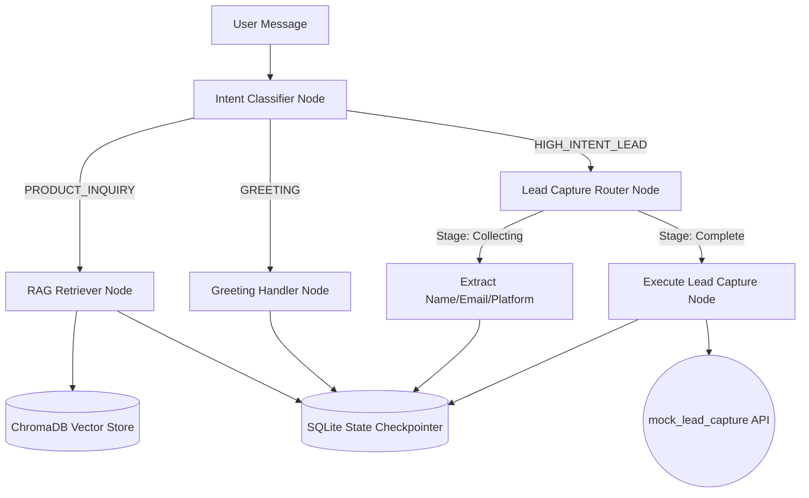

# AutoStream Conversational AI Agent

AutoStream Conversational AI Agent is a production-grade, stateful AI assistant built to intelligently guide users through the AutoStream video platform. By utilizing a directed graph architecture, the system accurately classifies user intent in real-time, answers complex product inquiries using a RAG-powered knowledge base, and dynamically shifts into a secure, multi-turn sales funnel to capture high-intent leads flawlessly. 

---

## 🚀 Getting Started

### 1. Install Dependencies
Ensure you have Python 3.10+ installed, then install the required packages:
```bash
pip install -r requirements.txt
```

### 2. Configure Environment Variables
Create a `.env` file in the root directory and add your Groq API key:
```env
GROQ_API_KEY=your_groq_api_key_here
```
*(You can obtain a free API key from the [Groq Console](https://console.groq.com/).)*

### 3. Build the Knowledge Base
Before starting the agent, you must initialize the local vector database. Run the ingestion script to parse and embed the AutoStream documentation into ChromaDB:
```bash
python ingest.py
```

### 4. Start the Conversation
You can interact with the agent via a premium dark-themed web interface or the terminal.
To launch the frontend UI:
```bash
streamlit run streamlit_app.py
```
To run the agent strictly in the terminal:
```bash
python agent.py
```

---

## 🏗 Architecture & State Management

LangGraph is chosen for the AutoStream agent because it models conversational logic as a directed cyclic graph, rather than a rigid linear pipeline. This architecture is essential for handling unpredictable multi-turn conversations where a user might ask a pricing question, pivot to signing up, and then interrupt the signup flow with another product question.

Instead of relying on fragile, deeply nested if-statements, LangGraph explicitly defines conversational states as nodes and transitions as conditional edges. Each node acts as an isolated Python function that receives the current conversation state, executes its specific logic (like classifying intent, querying ChromaDB for RAG, or extracting an email address), and returns an updated state object. 

Conversation memory is maintained using a state schema (`AgentState`) combined with the `SqliteSaver` checkpointer. Every time a user sends a message, their unique `thread_id` is passed to the graph. The checkpointer automatically loads their historical messages, intent history, and partial lead data from the `checkpoints.db` file. Once the graph finishes its execution cycle, the new state is saved back to SQLite. This transparent persistence means users can drop off and return hours later, and the agent will seamlessly resume the conversation exactly where they left off.



---

## 💬 WhatsApp Webhook Integration

To integrate this agent with WhatsApp, you would use the WhatsApp Business API through Meta's Cloud API. You would deploy the LangGraph agent as a FastAPI or Flask web service on a cloud server such as a free-tier Railway or Render instance. You would register a webhook URL with Meta's developer portal pointing to your server's `/webhook` endpoint. 

When a WhatsApp user sends a message, Meta sends an HTTP POST request to your webhook containing the sender's phone number and message text. Your server extracts the phone number as the `thread_id` for LangGraph's checkpointer—this is how you maintain per-user conversation state across multiple messages. The server invokes the LangGraph agent with that `thread_id`, gets the response, and sends it back to the user via a POST request to Meta's messages API endpoint with your access token. The phone number as `thread_id` means every user automatically gets their own isolated conversation memory, and the `SqliteSaver` checkpointer handles storing and retrieving it transparently.

---

## 🌟 Example Conversation (Happy Path Flow)

```text
User:    What are the limits on the basic plan?
Agent:   The Basic Plan ($29/month) allows you to create up to 10 videos per month 
         in 720p HD resolution. It's a great starting point for occasional creators!
         [Source: basic_plan.txt]

User:    That sounds nice, I want to sign up.
Agent:   Awesome, let's get you set up! 🎉 What's your first and last name?

User:    Janhvi Saste
Agent:   Nice to meet you, Janhvi Saste! 😊 What email should we use for your account?

User:    janhvi123@gmail.com
Agent:   Got it! Almost there — what platform do you mainly stream on? (e.g. YouTube, Twitch)

User:    YouTube
Agent:   🎉 You're officially in, Janhvi Saste! Your AutoStream account is being set up now. 
         Check janhvi123@gmail.com for your welcome email with everything you need to start 
         creating amazing content on YouTube. Welcome to the AutoStream family! 🚀

[System]: 🎯 LEAD CAPTURED — mock_lead_capture() FIRED successfully!
          Payload: {name: "Janhvi Saste", email: "janhvi123@gmail.com", platform: "Youtube"}
```
